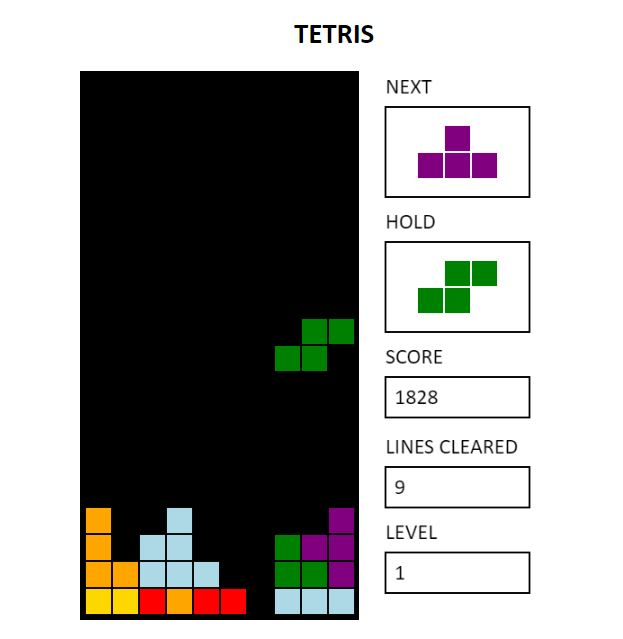

# [JavaScript Tetris](https://hyojunm.github.io/tetris/)
A remake of the *Tetris* game using the `HTML5 canvas` and `JavaScript (jQuery)`.

## Controls
- <kbd>&#8594;</kbd> : Move right
- <kbd>&#8592;</kbd> : Move left
- <kbd>&#8593;</kbd> : Rotate
- <kbd>&#8595;</kbd> : Soft drop
- <kbd>Space</kbd> : Hard drop
- <kbd>C</kbd> : Hold
